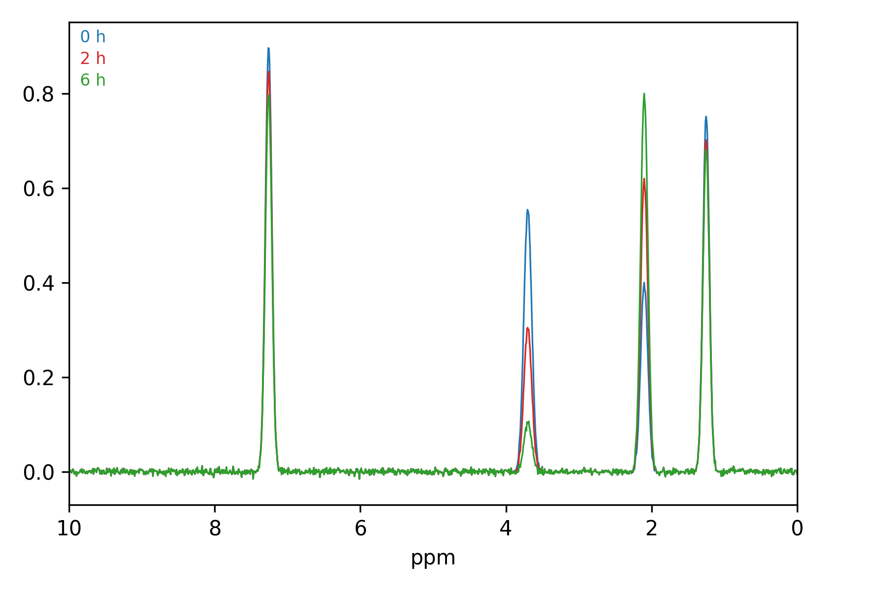
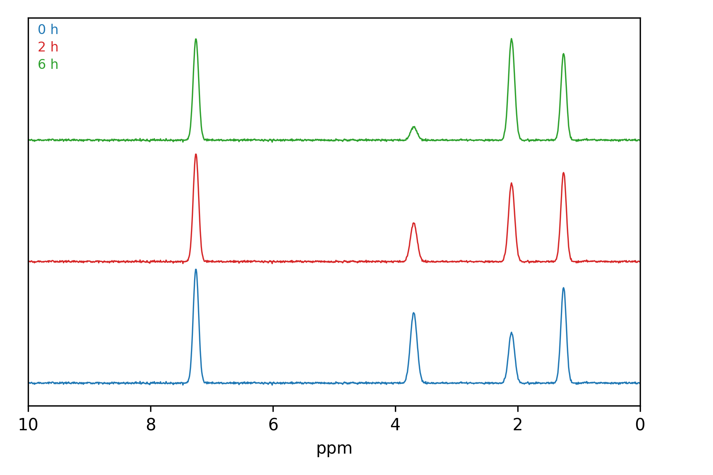
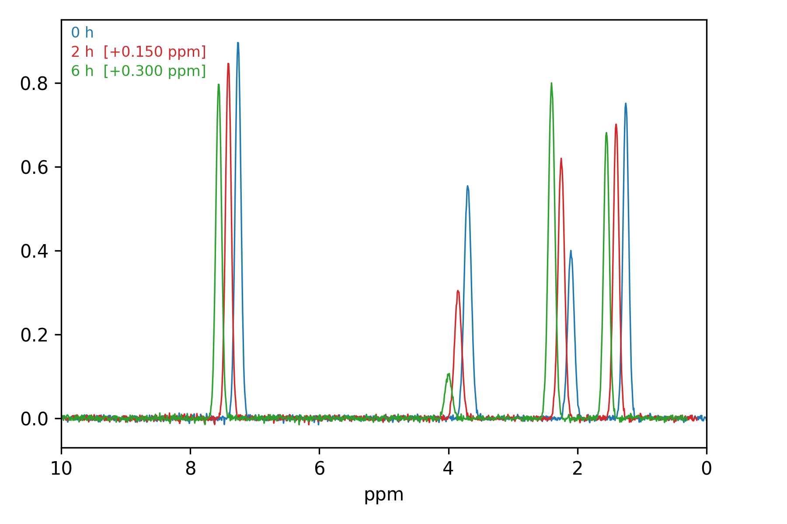
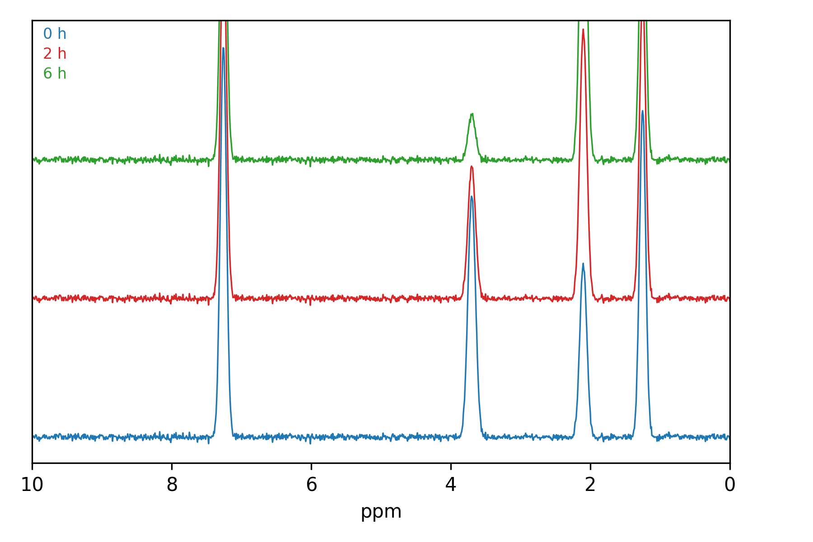

# HelSpin — User Manual

Version 0.5.13

Compare Bruker NMR spectra and build publication figures.

Contact: iwai@ligsciss.com

---

## 1. What HelSpin is for

You have a folder of Bruker datasets and a question that needs several of them
side by side: did the reaction go, does this batch match the reference, which
of six conditions gave the cleanest product. HelSpin opens them together,
lets you line them up, and exports the result at publication quality.

It reads Bruker data directly from wherever it already lives, including a
mounted spectrometer share. **It never writes to your data.** Everything you
adjust — scale, position, colour, zoom — is display state, held in HelSpin and
saved in its own session files.

---

## 2. Getting started

### Adding a data root

**File → Add Data Root…**, then pick the folder your datasets sit under. Point
it at a directory that *contains* sample folders, not at a single dataset.
HelSpin walks down looking for the Bruker structure (a sample folder holding
numbered experiment folders) and shows what it finds.

You can add more than one root — a network share and a local archive, say —
and they persist between sessions.

Symlinks are followed, so a root made of links to the real instrument mounts
works normally. Links pointing back at a parent are detected and not followed
twice, so a loop cannot hang the scan.

### The browser

The left panel is the tree: root → sample → experiment. Type in the filter box
to narrow by sample name or pulse programme; the filter reaches samples that
have not been expanded yet.

The tree does **not** watch the filesystem. Network shares make that
unreliable, so refreshing is explicit: right-click a node to refresh it, or
**Refresh All** / **F5**.

### Opening spectra

Drag a dataset onto the canvas, or double-click it. Repeat to add more. Each
one becomes a *trace* listed in the right-hand panel.

If a dataset does not appear, ask HelSpin what it sees on disk:

```
helspin --check /path/to/SAMPLE
```

That reports, experiment by experiment, whether a plottable spectrum is
actually there.

---

## 3. Arrangements: overlay and stacked

**Overlay** draws every spectrum on one set of axes, sharing a baseline. Use it
to compare peak positions and relative intensities directly.



**Stacked** gives each spectrum its own lane, evenly spaced. Use it when the
traces would otherwise obscure each other, and for showing a progression.



Switch with the arrangement control. The frame is re-fitted on switching,
because offsets that suit one layout rarely suit the other.

---

## 4. Adjusting a spectrum

Select a trace in the right-hand panel first — adjustments apply to the
selection.

### Y scale — the wheel

With both zoom toggles off, the **mouse wheel over the plot scales the selected
spectrum** vertically. This changes that spectrum's height relative to the
others, which is what you want when one sample is far more concentrated than
another.

Nothing happens if no trace is selected. That is deliberate: guessing which
spectrum you meant would be worse than asking you to click one.

### Y offset

Moves the selected spectrum up or down. Pure translation — it does not rescale
anything and does not re-fit the view.

**To bottom** drops the selected spectrum to the baseline; **Bottom all** does
every spectrum at once.

### X offset — shifting along ppm

**Spectrum list → X offset**, in ppm. Shifts the selected spectrum
horizontally. Two uses: correcting spectra that were referenced slightly
differently, and skewing a stack into a cascade.



The step size and range come from the spectrum's own width, so the control
behaves sensibly for a ¹H spectrum spanning 12 ppm and a ¹³C one spanning 200.
You can shift up to half a spectrum width in either direction.

> **A shifted spectrum says so.** An X offset moves a trace along the chemical
> shift axis, so its peaks no longer read at their true values. HelSpin marks
> any shifted trace in the spectrum list *and on the plot label* —
> `2 h  [+0.150 ppm]` — so a figure never quietly claims a peak sits somewhere
> it does not. The marker disappears when the shift returns to zero.
>
> The underlying data is never modified. Peak readout always reports true,
> unshifted ppm, and **Clear X offsets** returns everything to its real
> chemical shift in one action.

### Appearance

Colour, line width and line style are per-spectrum, in the spectrum list.
Defaults come from the slot palette in Preferences, so the first spectrum you
open always looks the same way.

---

## 5. Zooming

Two independent toggles in the bottom bar: **X zoom** and **Y zoom**. They are
not exclusive — with both on, the wheel zooms both axes at once.

| Toggle | What the wheel does |
|---|---|
| Both off | Scales the **selected spectrum** vertically |
| X zoom | Zooms the ppm axis about the cursor |
| Y zoom (overlay) | Zooms the intensity axis about the cursor |
| Y zoom (stacked) | **Magnifies all spectra**, leaving the lanes where they are |
| Both on | Zooms both axes together |

Zooming keeps the point under the cursor fixed, so a peak of interest does not
walk off the edge.

With **X zoom** on, you can also drag a box on the plot to zoom into it.

### Y zoom in stacked mode is different, on purpose

In a stack, the layout *is* a set of lanes at fixed baselines. Narrowing the
vertical window there would not magnify the stack — it would crop it, pushing
whole spectra off the canvas.

So in stacked mode the wheel **magnifies the traces** and leaves the baselines
exactly where they are. Peaks grow in place, overflow their lane, and can run
off the top of the canvas.



That overflow is intended. Bringing up a weak signal beside a strong one can
need magnification of many orders of magnitude, so **there is no limit** in
either direction.

### Getting back

- **Fit Y** — re-frames the vertical axis and clears any Y zoom or
  magnification.
- **Full** — shows everything, in every axis.
- **Ctrl+Z** — undoes it, including Fit Y.

A zoom is sticky: it survives loading another spectrum, removing one, changing
the ppm window and redrawing. Turning the toggle off does not undo it. Only
Fit Y, Full, reset or undo clear it.

---

## 6. Setting the ppm window

The bottom bar takes a typed range. ppm axes descend, so the **left** box is
the higher value. **Apply** sets it; **Full** clears it.

Recently used ranges are remembered, so returning to an aromatic window across
several samples is one click.

Narrowing the window re-fits the vertical frame to the data actually in view —
otherwise zooming into a quiet region would keep the scale set by peaks
outside it and show you a flat line. An explicit Y zoom outranks that and is
kept.

---

## 7. Undo

**Ctrl+Z** / **Ctrl+Y** (or **Ctrl+Shift+Z**). Forty steps.

Undo covers display state — scales, offsets, zooms, colours, adding and
removing spectra. It never re-reads a file, so undoing a change costs nothing
even with data on a slow share, and undoing a removal brings the spectrum back
instantly with its data intact.

Typing into a spin box is one undo step, not one per keystroke.

---

## 8. Sessions

**File → Save Session…** writes everything about the current view: which
datasets are open, and every scale, offset, colour, zoom and window. **File →
Open Session…** restores it.

Sessions store *paths*, not spectra. If the underlying data has moved, the
session cannot find it — keep the data root stable, or re-add the root.

Restoring clears the undo history, so an opened session cannot be undone into
the state that preceded it.

---

## 9. Exporting a figure

**Save Image…**. Choose PNG, PDF, or SVG by the extension you type; PDF and
SVG stay vector and are what you want for a manuscript.

- **300 dpi** by default.
- **Transparent background** is available for slides.
- The exported figure matches what is on screen, including any X offset
  markers.

---

## 10. Where HelSpin keeps its files

| What | macOS / Linux | Windows |
|---|---|---|
| Settings | `~/.config/HelSpin/` | registry |
| Index cache, licence | `~/.cache/helspin/` | `%LOCALAPPDATA%\HelSpin\cache` |

On Linux, `XDG_CACHE_HOME` is honoured — worth setting if `/home` is a slow
network mount, since the cache belongs on local disk. `HELSPIN_CACHE_DIR`
overrides it explicitly on any platform.

Deleting the cache is safe; it is rebuilt on the next scan.

---

## 11. Troubleshooting

**A sample is missing from the tree.** Run `helspin --check /path/to/SAMPLE`.
Note that Bruker writes `acqus`, `pdata` and `1r` in lower case and Linux
filesystems are case-sensitive, so data copied from Windows by a tool that
changed case will not be recognised.

**Permission denied on a share.** Confirm you can read it outside HelSpin
first (`ls /mnt/nmr`). An unreadable subtree is stepped over silently by
design, so one locked folder does not cost you the rest of the share.

**Linux: the application will not start**, with a Qt platform plugin error.
Install `libxcb-cursor0` (Debian/Ubuntu), `xcb-util-cursor` (Fedora/Arch).
See INSTALL.md.

**Linux: the window never appears, no error.** Check for a leftover
`QT_QPA_PLATFORM=offscreen` in your shell.

**A spectrum vanished after zooming.** Press **Fit Y**.

**The plot looks wrong and you cannot say why.** **Full**, then **Fit Y**,
returns to a neutral view without closing anything.

---

## 12. Known limitations

Stated plainly, because finding these out mid-figure is worse.

- **Differences and sums ignore an X offset.** If you align two spectra
  horizontally and then subtract, the subtraction uses their true ppm axes,
  not the aligned ones.
- **No automatic file-watching.** Refresh is explicit, by design — see §2.
- **The TopSpin bridge is not wired up.** TopSpin identifiers parse, but there
  is no live connection to a running TopSpin.
- **Windows and macOS are not yet verified end to end.** Development and the
  test suite currently run on Linux. The Windows installer path in particular
  has not been exercised from start to finish.

---

## 13. Licence

Free for academic research, teaching and personal use. Commercial use requires
a licence — enquiries to **iwai@ligsciss.com**. Full terms in `LICENSE`, and
readable in the application at **Help → Licence**.

Qt (via PySide6) is LGPLv3 and is packaged one-directory so its shared
libraries stay replaceable. nmrglue, NumPy and SciPy are BSD; matplotlib is
BSD-style.
